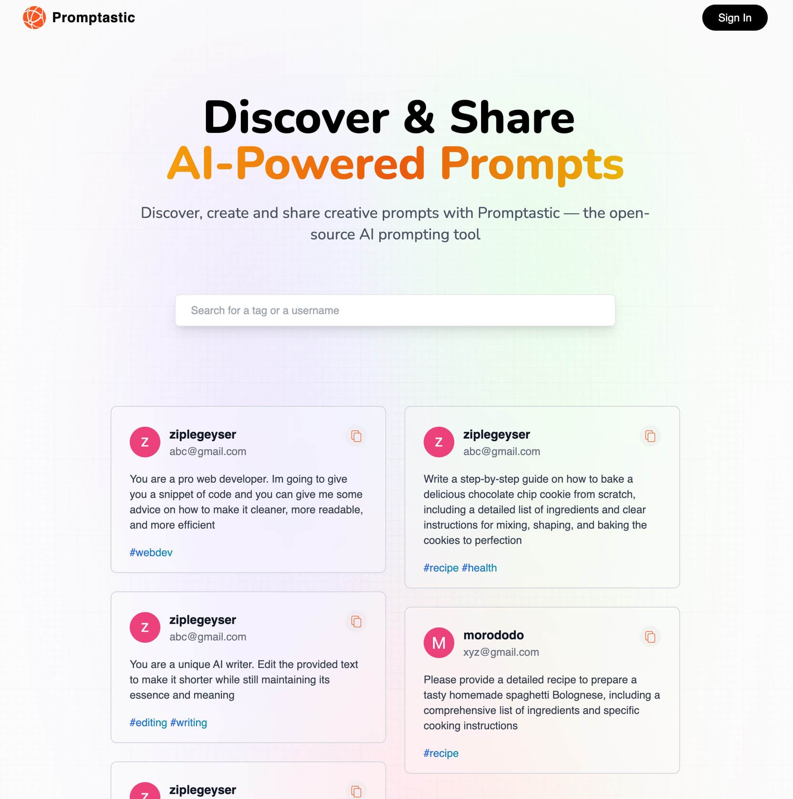

# Promptastic

This promptastic application allows the user to discover and share different AI prompts. It's a serverless JAM application coded with Next.js 13 and is running on top of MongoDB (Atlas). It allows a user to perform all basic CRUD operations, such as creating, deleting, updating, and fetching prompts by interfacing with an Atlas cloud database service without the need to set up and manage own db server. For the UI, I primarily used Tailwind CSS and integrated a Radix component for the menu. On the main page, the user has the option to filter prompts by search. The application also includes an authentication and authorization mechanism using the Next-Auth package allowing users to have their own private profile pages.